## Lord of the Rings Quiz

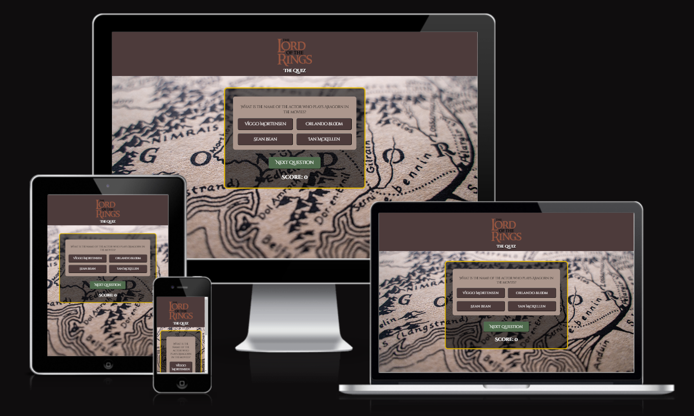

[View my live project](https://ianoc1994.github.io/lotr_quiz/)

---

## Table of Contents

* [Criteria](#criteria)
* [UXD (User Experience Design) ](#user-experience-ux)
   * [User Stories](#user-stories)
   * [Wireframes](#wireframes)
* [Design](#design)
  * [Colour Scheme](#color-scheme)
  * [Typography](#typography)
* [Features](#features)
  * [Desktop View](#Desktop-view)
  * [Tablet View](#tablet-view)
  * [Mobile View](#mobile-view)
* [Goal](#goal)
* [Problem Statement](#problem-statement)
* [Target Audience](#target-audience)
* [Benefits](#Benefits)
* [Submission](#submission)
* [Deployment](#deployment)
* [Future Features](#future-features)
* [Technologies Used](#technologies-used)
  * [Languages Used](#languages-used)
* [Testing](#testing)
  * [HTML Validation using W3C Validation](#html-validation-using-w3c-validation)
  * [CSS Validation using W3C Validation](#css-validation-using-w3c-validation)
  * [Lighthouse scores via Chrome Developer Tools](#lighthouse-scores-via-chrome-developer-tools)
* [Credits](#credits) 
---

### **Criteria**  

1. Purpose & Focus
The quiz must first and formost be fun. It should focus on the topic of the Lord of the Rings and more specifically questions relating to the movie trilogy.

2. Accessibility and Usability
The website must be intuitive and user-friendly. Content and features should be accessible on both desktop and mobile devices. Transitions from question to question should be smooth and provide a seamless user experience.

3. Feedback Feature
The quiz should provide feedback to the user in the form of a correct or incorrect message after each question.

4. Try Again Feature
The quiz should end with a screen that presents you with a final score message and the option to try again. This will present in the form of a button which, upon clicking, will redirect the user back to the home page. 

[Back to Table of Contents](#table-of-contents)

---

## User Experience (UX)  

### Primary Goal

The primary goal of this site is to provide a fun, friendly quiz that serves as a source of entertainment to the user. It should also provide fans of Lord of the Rings books and movies with the oppurtunity to test there knowledge. 

### **First Time Users**

- First time users will be met with an accessible and user-friendly environment to test there knowledge on the topic of the Lord of the Rings.

- First time users will notice a theme reminiscint of the movies with similar colour schemes and iconography that was used.

- First time users will be provided with feedback at the end of each question as to whether they were correct or incorrect.

- First time users will be provided with a score counter which will update after each question provided the user gets the answer right.

First time users will be given the oppurtunity to try the quiz again at the end. This will redirect the user back to the start of the quiz. 

### **Returning Users** 

- Returning users will find the same user-friendly interface.

[Back to Table of Contents](#table-of-contents)

---

## User Stories

User Stories
 

### User Story: create wireframes
**Label:** Must Have

---

### User Story: Content Creation
**Label:** Must Have

---

### User Story: Images & Logos
**Label:** Must Have

---

### User Story: Favicons and title
**Label:** Must Have

---

### User Story: Next Question Button
**Label:** Must Have

---

### User Story: Try Again Function
**Label:** Should have

---

### User Story: User Feedback
**Label:** Should have

---

### User Story: Character images upon correct answer input
**Label:** Enhancement

---

### User Story: difficulty levels
**Label:** Enhancement

---

### User Story: User Profile with score retention
**Label:** Enhancement

---

[Back to Table of Contents](#table-of-contents)

---

# Wireframes

Wireframe - Mobile - Home Page & Quiz 
  

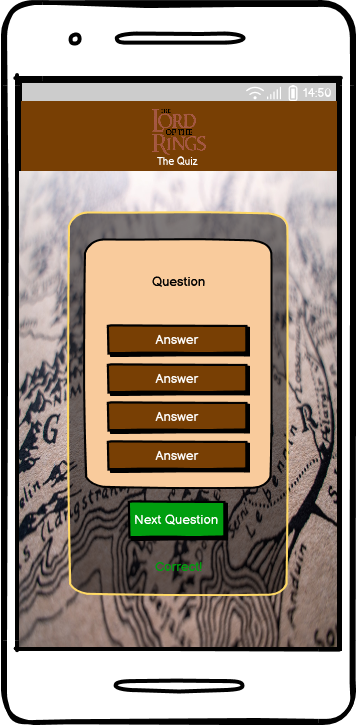

 

Wireframe - Mobile - Quiz End & Try Again 
  

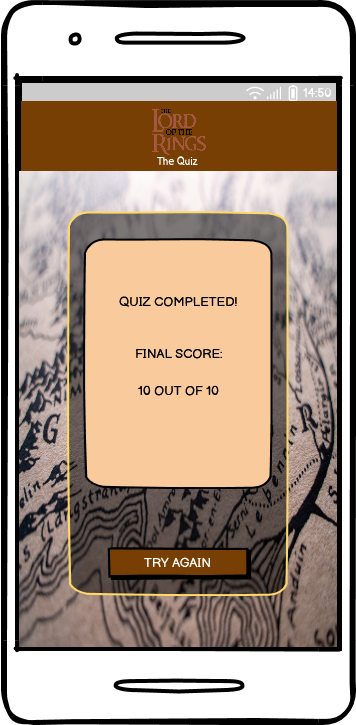

 

Wireframe - Tablet - Home Page & Quiz 
  

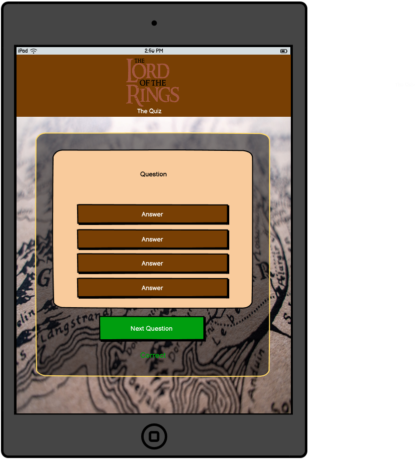

 

Wireframe - Tablet - Quiz End & Try Again 
  

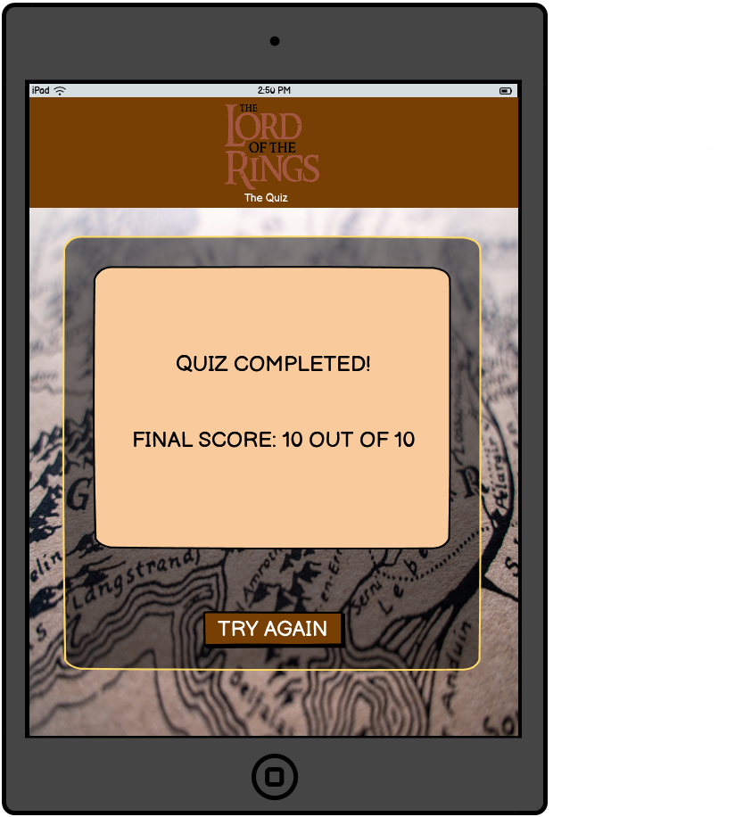

 

Wireframe - Laptop - Home Page & Quiz 
  

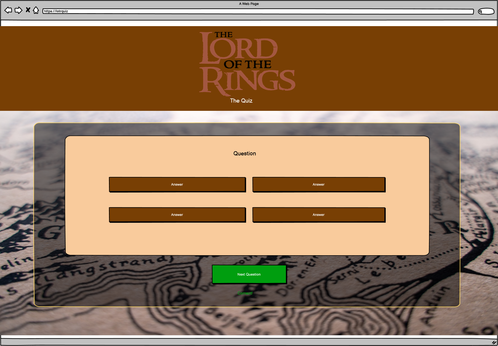

 

Wireframe - Laptop - Quiz End & Try Again 
  

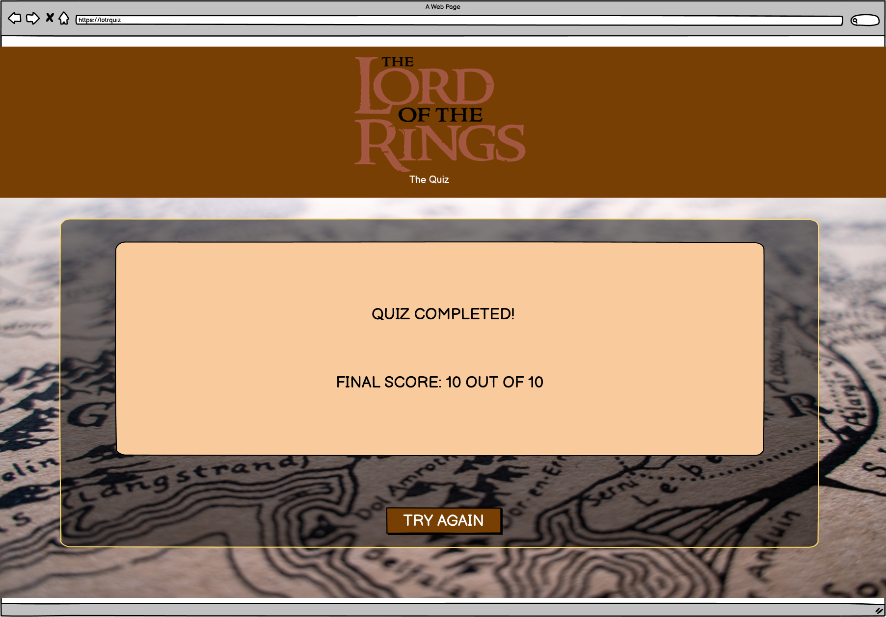

 

[Back to Table of Contents](#table-of-contents)

---

# Design

  # Colour Scheme

  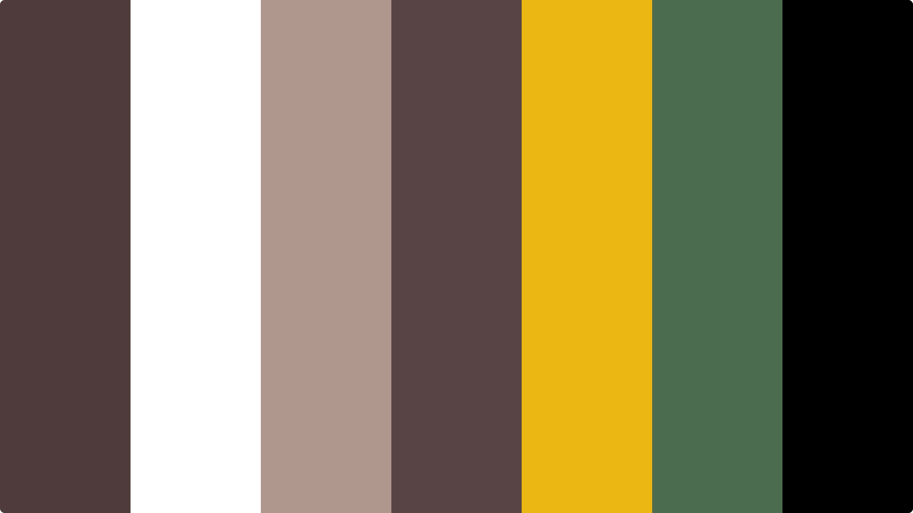

  # Typography

  [Cinzel Decorative](https://fonts.google.com/specimen/Cinzel+Decorative)

[Back to Table of Contents](#table-of-contents)

---

# Features

## Desktop View

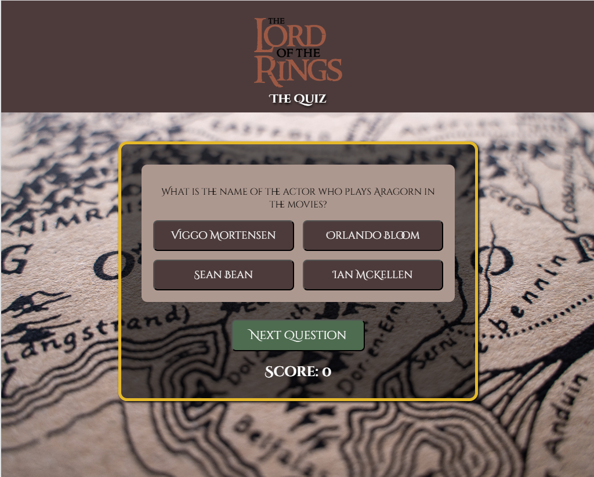

### Tablet View

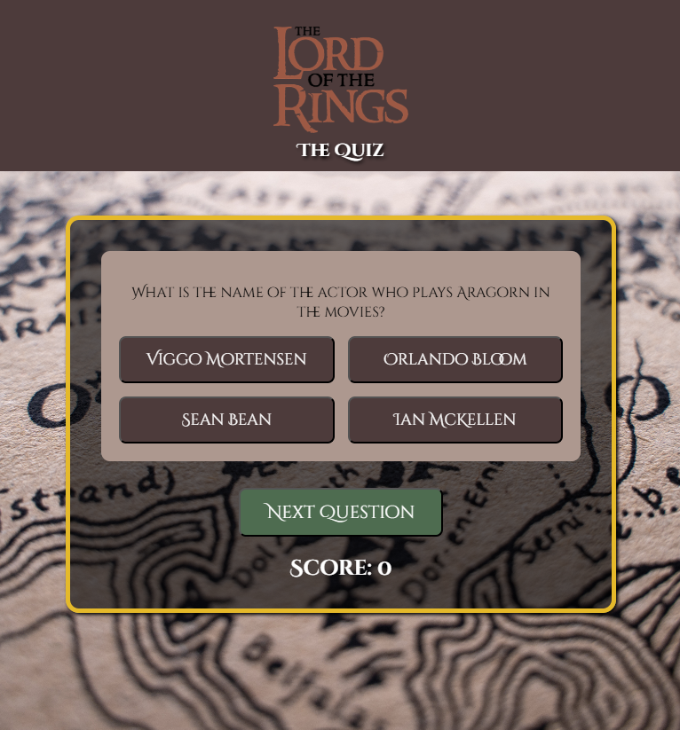

### Mobile View

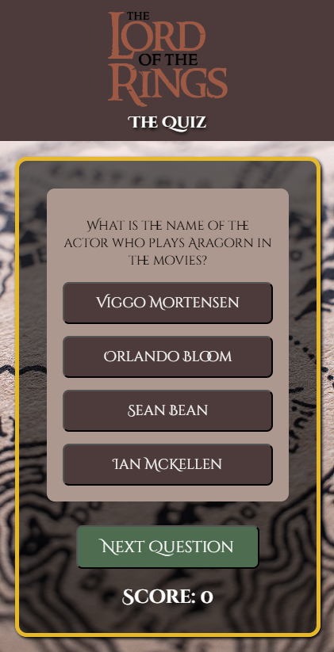

### Favicon

### Header

### Background

### Quiz Container

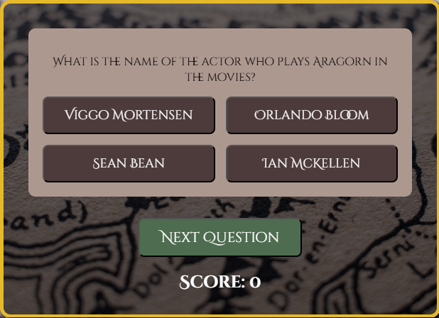

### Feedback & Score Counter

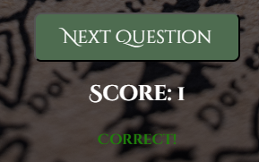

### Quiz End & Try Again Feature

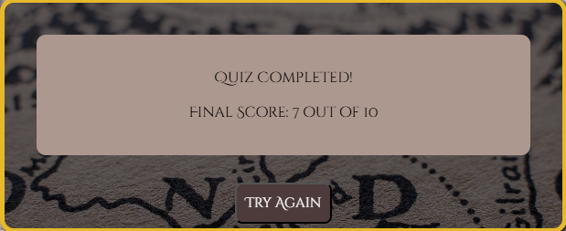

[Back to Table of Contents](#table-of-contents)

---

# **Goal**   

### Key Goals:

1. **Functionality and Design**:  
   

 
## Objective(s)  
 

## Target Audience  
  

[Back to Table of Contents](#table-of-contents)

---

# Deployment

The site was deployed to GitHub Pages. The steps to deploy are as follows:
- In the [GitHub repository](https://github.com/IanOC1994/lotr_quiz), navigate to the Settings tab 
- From the source section drop-down menu, select the **Main** Branch, then click "Save".
- The page will be automatically refreshed with a detailed ribbon display to indicate the successful deployment.

The live link can be found [here](https://github.com/IanOC1994/lotr_quiz/deployments)

### Local Deployment

This project can be cloned or forked in order to make a local copy on your own system.

#### Cloning

You can clone the repository by following these steps:

1. Go to the [GitHub repository](https://github.com/IanOC1994/lotr_quiz) 
2. Locate the Code button above the list of files and click it 
3. Select if you prefer to clone using HTTPS, SSH, or GitHub CLI and click the copy button to copy the URL to your clipboard
4. Open Git Bash or Terminal
5. Change the current working directory to the one where you want the cloned directory
6. In your IDE Terminal, type the following command to clone my repository:
	- `git clone https://github.com/IanOC1994/lotr_quiz.git`
7. Press Enter to create your local clone.

#### Forking

By forking the GitHub Repository, we make a copy of the original repository on our GitHub account to view and/or make changes without affecting the original owner's repository.
You can fork this repository by using the following steps:

1. Log in to GitHub and locate the [GitHub Repository](https://github.com/IanOC1994/lotr_quiz)
2. At the top of the Repository (not top of page) just above the "Settings" Button on the menu, locate the "Fork" Button.
3. Once clicked, you should now have a copy of the original repository in your own GitHub account!

## Local VS Deployment

There are no difference between the deployed version and the development version.

[Back to Table of Contents](#table-of-contents)

---

## Future Features  

The following features are some of the elements I would like to implement outside of the project timeline.   

### 1. **Difficulty levels**  

In a future version of this quiz I would like to introduce different levels to allow users to access a variety of different questions at differing difficulty.

### 2. **Question Randomiser**

In a future version of this quiz I would like to introduce a larger number of questions which would allow the quiz to randomise each time the try again button was selected. This would make the quiz more fun and allow users to have a different experience each time they return to the quiz.
 
### 3. **User Profile** 

In a future version of this quiz I would like to implement a feature that allows users to set up gamer profiles which will keep track of their scores.

### 4. **Score Table** 

In a future version of this quiz I would like to implement a user score table which would allow the user to compete against other users. 

 [Back to Table of Contents](#table-of-contents)

---

# Tech Stack

## Languages Used 
- HTML
- CSS
- JavaScript

[Back to Table of Contents](#table-of-contents)

---

# Testing

## HTML Validation

### index.html

## CSS Validation

## JS Validation

### script.js

### escape.js

## Lighthouse 

### Desktop

### Mobile

[Back to Table of Contents](#table-of-contents)

---

# **🌟 Credits** 

- ChatGPT for genarating questions and answers for the site.

[Back to Table of Contents](#table-of-contents)

